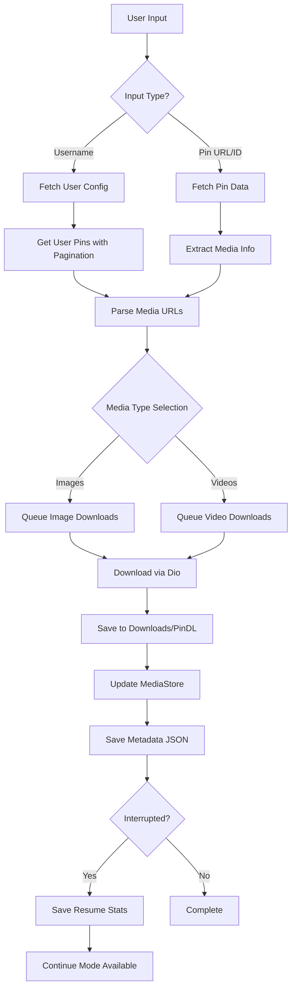

<div align="center">


# PinDL

<small>A personal-use utility app for downloading publicly accessible Pinterest content. Built with Flutter for a modern, responsive mobile experience.</small>

[](https://dart.dev/)
[](https://flutter.dev/)
[](https://kotlinlang.org/)
[](https://developer.android.com)
[](LICENSE)
[](https://android-arsenal.com/api?level=26)

</div>

PinDL is a Flutter-based Android application that allows users to download publicly accessible images and videos from Pinterest. It supports downloading content from: **Individual Pins** (`URL` or `PIN ID`) and **User Profiles** (Bulk download from any public `Pinterest username`). The app features a beautiful Neumorphism (Soft UI) design with both light and dark themes. See also the CLI version of the same tool built using Node.JS: [motebaya/pinterest-js](https://github.com/motebaya/pinterest-js)

## How It Works



## Features

> [!IMPORTANT]
> **Feature full Explanation & Demo**: [See Here](SHOWCASE.md)

| Feature                              | Status |
| ------------------------------------ | ------ |
| Download from Pinterest username     | ✅     |
| Download single pins via URL         | ✅     |
| Download single pins via pin ID      | ✅     |
| Image download support               | ✅     |
| Video download support (720p)        | ✅     |
| Batch/bulk downloads                 | ✅     |
| Resume interrupted downloads         | ✅     |
| Metadata saving (JSON)               | ✅     |
| Skip existing files                  | ✅     |
| Overwrite mode                       | ✅     |
| Light theme                          | ✅     |
| Dark theme                           | ✅     |
| Download history                     | ✅     |
| Extraction history                   | ✅     |
| MediaStore integration (Android 10+) | ✅     |
| Video preview playback               | ✅     |
| Continue from last position          | ✅     |

## Project Structure

```
lib/
├── core/
│   ├── constants/          # App constants and Pinterest API config
│   ├── exceptions/         # Custom exception classes
│   ├── theme/              # App themes and Neumorphism styles
│   └── utils/              # Utility functions and validators
├── data/
│   ├── models/             # Data models (Pin, Author, etc.)
│   └── services/           # API and download services
├── presentation/
│   ├── pages/              # UI screens (Home, History, About, etc.)
│   ├── providers/          # Riverpod state management
│   └── widgets/            # Reusable Soft UI widgets
└── main.dart               # App entry point

android/
├── app/
│   ├── src/main/kotlin/    # Kotlin code (MainActivity, MediaStore)
│   └── build.gradle.kts    # Android build configuration
└── key.properties          # Signing configuration (not in git)
```

## Building

### Prerequisites

- Flutter SDK 3.10.8 or higher
- Android SDK
- Java JDK 17
- Keytool (for release builds)

### Development/Debug Build

```bash
# Get dependencies
flutter pub get

# Run in debug mode
flutter run

# Build debug APK
flutter build apk --debug
```

The debug APK will be at: `build/app/outputs/flutter-apk/app-debug.apk`

### Production/Release Build

#### Using Build Scripts (Recommended)

**PowerShell (Windows):**

```powershell
# First time: Generate keystore, clean, and build
.\build_prod.ps1 -GenerateKeyStore -Clean -BuildRelease

# Subsequent builds
.\build_prod.ps1 -BuildRelease

# Clean only
.\build_prod.ps1 -Clean

# Show help
.\build_prod.ps1 -Help
```

**Bash (Linux/macOS):**

```bash
# Make script executable (first time only)
chmod +x build_prod.sh

# First time: Generate keystore, clean, and build
./build_prod.sh --generatekeystore --clean --build-release

# Subsequent builds
./build_prod.sh --build-release

# Clean only
./build_prod.sh --clean

# Show help
./build_prod.sh --help
```

#### Manual Build (Without Scripts)

1. **Generate Keystore:**

```bash
keytool -genkey -v \
  -keystore android/pindl-release.jks \
  -alias pindl \
  -keyalg RSA \
  -keysize 2048 \
  -validity 10000
```

2. **Create `android/key.properties`:**

```properties
storePassword=your_store_password
keyPassword=your_key_password
keyAlias=pindl
storeFile=../pindl-release.jks
```

3. **Build Release APK:**

```bash
flutter build apk --release
```

The release APK will be at: `build/app/outputs/flutter-apk/app-release.apk`

## Storage Structure

Downloaded files are saved to:

```
Downloads/
└── PinDL/
    ├── @username/
    │   ├── Images/         # Downloaded images
    │   ├── Videos/         # Downloaded videos
    │   └── <userId>.json   # User metadata with resume stats
    └── metadata/
        └── <pinId>.json    # Single pin metadata
```

## Legal Notice

This app is intended for **personal use only**. It only handles publicly accessible content. Users are responsible for ensuring their use complies with Pinterest's terms of service and applicable laws.

- Do not use this app for commercial purposes
- Respect content creators' rights
- Only download content you have permission to use

## License

This project is licensed under the MIT License - see the [LICENSE](LICENSE) file for details.
